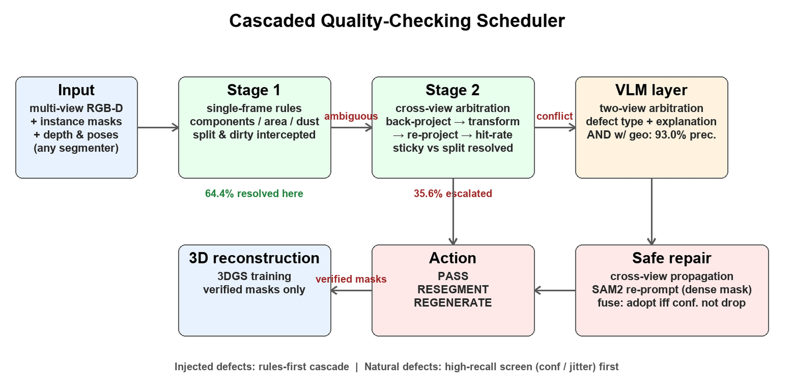
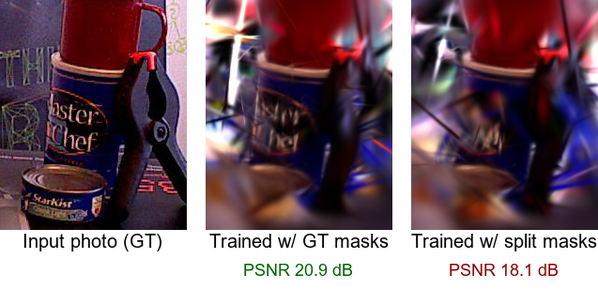

# Cascade-QC-3DGS：3D 实例分割质量校验闭环

> **English** · Cascaded quality verification of instance segmentation for 3D reconstruction.
> Promptable segmenters (e.g., SAM 2) produce defective masks—debris (dirty), fragmentation
> (split), merging (sticky)—that corrupt downstream 3D Gaussian Splatting. This project is a
> cascaded checker that routes each instance from zero-cost pixel rules, to cross-view
> geometric arbitration, to a VLM semantic layer, and safely repairs flagged masks behind a
> confidence fuse. It types defects at **90%+ accuracy on 570+ instances across three BOP
> datasets** (YCB-V / LINEMOD-O / T-LESS) while invoking cross-view computation for only
> ~35% of instances, recalls **0.88–0.93** of severe natural (non-injected) defects on
> held-out scenes, and closes the loop with measured reconstruction gains on real 3DGS
> (12 scenes, 20.17 dB PSNR). We also show that VLMs have a structural blind spot for
> sticky defects (0/10) that a second view largely rescues (89.5%), and that random
> single-view defects are absorbed by multi-view fusion (−0.17 dB) while systematic
> split costs 2.2 dB—exactly the class our cascade detects best.
> **Pipeline**: rule-based single-frame checks → cross-view re-projection → VLM review →
> fuse-gated repair → 3DGS verification. 中文说明见下文。

用 **VLM（Kimi K3）+ 确定性几何规则 + 跨视图一致性** 自动检测实例分割 mask 的缺陷
（干净 / 杂块 dirty / 分裂 split / 粘连 sticky），并验证
"检测出缺陷 → 触发重分割 → 提升 3D 重建质量"的闭环。本项目是一篇论文的实验代码库。

## 结果速览（Results at a Glance）

| 级联调度架构 | 缺陷修复前后（物体级 3DGS） |
|---|---|
|  |  |

- 级联 90%+ 缺陷分型 @ 35% 跨视图算力（YCB-V/LMO/T-LESS 三数据集，570+ 实例）
- 真实缺陷（非注入）高召回粗筛 R=0.88–0.93，几何∧VLM 复核精确率 93%
- 置信度保险丝 100% 拦截有害修复；随机缺陷被多视图容忍（−0.17dB），系统性分裂 −2.2dB

## Quickstart（2 分钟跑通核心检测器）

```bash
pip install -r requirements.txt

# 合成测试集上跑几何规则检测器（38 实例，预期 100% 检出）
python geo_checker.py --input data/test_images --masks data/test_masks \
    --objects data/test_objects --output results/geo_results.jsonl
python evaluate.py --answers results/test_answers.csv --predictions results/geo_results.jsonl

# 跨视图 + 级联调度（需要 BOP 数据集，见下方"数据获取与复现"）
python mv_eval_all.py --scene-dir data/real_data/test --pairs 3
python cascade_eval_all.py --scene-dir data/real_data/test --pairs 3

# VLM 质检（需 .env 中配置 Kimi API Key）
python checker.py data/sample/image_01.png
```

## 目录结构

```
vlm_checker/
├── 核心代码（根目录，按流水线阶段命名）
│   ├── config.py / schema.py        # 配置入口（读 .env）/ 输出结构定义（Pydantic）
│   ├── checker.py                   # VLM 单图检查 + 反思闭环（检测器 agent 原型）
│   ├── geo_checker.py               # Stage1：单帧确定性规则（连通域+颜色聚类+面积比）
│   ├── mv_checker.py                # Stage2：跨视图一致性（深度反投影→位姿变换→重投影）
│   ├── cascade_checker.py           # 级联调度器（核心决策模块）：PASS / RESEGMENT / REGENERATE
│   ├── make_test_images.py          # 合成测试图 + 自动 ground truth
│   ├── prepare_real_scene.py        # BOP 真实数据 → 缺陷注入三件套 + ground truth
│   ├── prepare_mv_data.py           # 跨视图缺陷数据生成
│   ├── batch_check.py / annotate.py / evaluate.py / list_models.py  # VLM 批量/标注/评估
│   ├── mv_eval_all.py / cascade_eval_all.py      # 12 场景全量评估
│   ├── run_sam2_real.py / run_sam2_batch.py      # SAM2 真实 mask 生成（GT 框作 prompt）
│   ├── eval_sam2_cascade.py                      # 级联判定 vs 真实 IoU 吻合度
│   ├── e2e_pipeline.py                           # 端到端闭环代理 v1（补救=GT 上限）
│   ├── e2e_remedy.py              # 闭环 v2：跨视图传播补救（覆盖/纯度双指标，三策略）
│   ├── e2e_reseg_sam2.py          # 闭环 v3：缺陷驱动 prompt 重跑 SAM2（需 pytorch-env）
│   ├── eval_baselines.py          # baseline 对比（面积一致性/边界梯度/solidity/自我置信度）
│   ├── make_object_masks.py       # PSNR 闭环：物体级 GT/缺陷/修复三组 mask 生成
│   ├── bop_to_colmap.py           # BOP → COLMAP + 深度反投影初始化点云
│   ├── train_gsplat.py            # 自包含 3DGS 训练（gsplat 1.5.3，需 CUDA，支持 --mask_dir）
│   ├── train_torchgs.py           # 纯 PyTorch 渲染器（无 GPU 时预览验证用，不用于训练）
│   ├── eval_psnr.py / eval_psnr_obj.py           # 全图 / 物体区域 PSNR
│
├── data/                  # 所有数据
│   ├── test_images/ test_masks/ test_objects/   # 合成集（10 图 38 实例）
│   ├── real_images/ real_masks/ real_objects/   # 真实缺陷注入集（6 图 28 实例）
│   ├── mv_masks/          # 跨视图缺陷 mask（20 个）
│   ├── sam2_real/         # SAM2 真实 mask（110 个）
│   ├── sample/            # 手动试跑用样例
│   ├── real_data/test/    # BOP'19 YCB-V 测试子集（12 场景 000048-000059）
│   ├── real_data_lmo/test/# BOP'19 LINEMOD-Occlusion（跨数据集泛化验证）
│   └── cloud_data/        # COLMAP 格式（12 场景 + obj0 三组 mask 实验数据）
│
├── results/               # 所有实验结果（jsonl / csv / txt 报告 / html）
│   └── render_output/     # 3DGS 渲染输出
├── cloud/                 # 云 GPU 相关：run_cloud*.sh、setup_env.sh、上云操作手册.md、上传包
├── docs/                  # 文档（论文草稿等）
├── _archive/              # 历史临时脚本（_patch/_diag/_probe 等，已无维护价值）
├── requirements.txt / .env
└── root_public_key.txt    # 云实例 SSH 私钥（勿提交、勿外传）
```

**新建文件的归属约定**：实验输出一律进 `results/`，数据一律进 `data/`，
云端材料进 `cloud/`，文档进 `docs/`，一次性调试脚本用完即移入 `_archive/`。

## 数据获取与复现（GitHub clone 后必读）

本仓库不含大体积数据文件（GitHub 限制），按以下步骤补齐即可完整复现：

1. **BOP 数据集**（约 2.5GB，放入 `data/`）：
   - YCB-V：[ycbv_test_bop19.zip](https://hf-mirror.com/datasets/bop-benchmark/ycbv/resolve/main/ycbv_test_bop19.zip) → 解压为 `data/real_data/test/`
   - LINEMOD-O：[lmo_test_bop19.zip](https://hf-mirror.com/datasets/bop-benchmark/lmo/resolve/main/lmo_test_bop19.zip) → 解压为 `data/real_data_lmo/test/`
   - T-LESS：[tless_test_primesense_bop19.zip](https://hf-mirror.com/datasets/bop-benchmark/tless/resolve/main/tless_test_primesense_bop19.zip) → 解压为 `data/real_data_tless/test_primesense/`
2. **COLMAP 训练数据**：`python bop_to_colmap.py --src data/real_data/test/000048 --dst data/cloud_data/000048`
   （`data/cloud_data/` 已随仓库附带 12 场景转换结果，可直接复训）
3. **3DGS 训练与渲染**：需要 CUDA GPU，流程见 `cloud/上云操作手册.md`（含 RTX 5090/sm_120 环境全套坑位）；渲染图（`results/render_output/`）由训练重新生成
4. **密钥**：复制 `.env.example` 为 `.env` 并填入 Kimi API Key（仅 VLM 实验需要）
5. 论文文稿（`docs/`）未随仓库公开，README 中相关引用仅指向本地路径

## 使用环境

```
conda activate langchain_env      # VLM/规则/跨视图/SAM2 实验（CPU 即可）
# 3DGS 训练需要 CUDA GPU，见 cloud/上云操作手册.md
```

（若换新环境：`pip install -r requirements.txt`）

## 实验流水线与结果（论文证据链）

### 阶段一：单帧 VLM vs 规则（合成图 + 真实图）

```powershell
python make_test_images.py --num 10 --seed 42            # 合成图 + 真值
python batch_check.py --input data/test_images --output results/test_results.jsonl
python evaluate.py --answers results/test_answers.csv --predictions results/test_results.jsonl
```

真实场景（BOP YCB-V 缺陷注入，28 实例）：

```powershell
python prepare_real_scene.py --test-dir data\real_data\test --scenes "000048,000049,000051" --frames auto --max-instances 5
python batch_check.py --input data/real_images --output results/real_results.jsonl
python geo_checker.py --input data/real_images --masks data/real_masks --objects data/real_objects --output results/geo_real_results.jsonl --mode real
```

| 检查器 | 合成图（38 实例） | 真实图（28 实例） | 失败模式 |
|---|---|---|---|
| VLM-only（Kimi K3） | 73.7%，sticky **0/10 全漏** | 39.1%，split 0/6 | 无图层感知；真实纹理掩盖切缝；编号读取不可靠 |
| Geo-only（规则） | **100%** | 53.6%，split 6/6 dirty 4/4，sticky 0/12 | 单帧无法区分 sticky/split（形状歧义） |

结论：VLM 对 sticky 是结构性盲区；规则能兜底几何缺陷，但 **sticky/split 的单帧歧义必须靠跨视图解决**。

### 阶段二：跨视图一致性 + 级联调度（12 场景）

```powershell
python prepare_mv_data.py            # 生成跨视图缺陷数据
python mv_eval_all.py                # 跨视图检查器全量评估
python cascade_eval_all.py           # 级联调度器全量评估
```

| 检查器 | 准确率 | 说明 |
|---|---|---|
| 跨视图（mv_checker） | 75.0%（117/156） | split 92.3%、sticky 79.3%；dirty 24.2% 是弱点（杂块随刚体运动，跨视图仍自洽） |
| **级联（cascade_checker）** | **90.0%**（144/160） | split 100%、dirty 100%、sticky 89.7%，漏检仅 3；**跨视图调用率仅 35.6%**（省算力证据） |

> 规模为每场景最多 3 个视角分桶帧对（12 场景 160 实例），早期单帧对版本（53 实例）为
> 75.5% / 90.9%，扩样后结论稳定。

**跨数据集泛化（BOP 另两个数据集）**：

| 数据集 | 跨视图-only | 级联 | 跨视图调用率 | 说明 |
|---|---|---|---|---|
| YCB-V（12 场景 160 实例） | 75.0% | **90.0%** | 35.6% | 主结果 |
| LMO（1 场景 17 实例，小样本） | 33.3% | **88.2%** | 29.4% | 物体小，跨视图大量失效 |
| T-LESS（20 场景 395 实例） | 79.3% | **90.9%** | 35.7% | 无纹理物体；深度需 ×1.05 校正 |

T-LESS 上 split/dirty/sticky 检出 100% / 100% / 98.8%（漏检仅 1/395）。重要发现：
**T-LESS 的 PrimeSense 深度存在约 5% 系统性偏小**（双向命中率不对称诊断定位，
`--depth-bias 1.05` 校正后 B→A 命中率 0.18→0.95）——跨视图几何对深度校准敏感，
深度偏差校正应作为方法的标准预处理。LMO 物体在画面中占比小，跨视图-only 因可见采样
不足大量失效——反向印证级联"Stage1 规则兜底"的必要性。
数据集适配参数：`--depth-scale`（自动读元数据）、`--min-vis`（LMO 用 50）、
`--depth-bias`（T-LESS 用 1.05）。

级联策略：Stage1 单帧规则拦截 split/dirty → 单帧无解才升级 Stage2 跨视图复核
（aggressive 路由：宁可多拦，漏检放行进重建代价更高）。

### 阶段二补充：Baseline 对比（`eval_baselines.py` → `results/baselines_report.txt`）

设置 1：注入缺陷检出（160 实例，与级联同数据；基线给 oracle 阈值——扫遍所有阈值取最优，
对基线最宽容）：

| 方法 | AUC | 最佳准确率 |
|---|---|---|
| 跨视图面积一致性（朴素几何） | 0.832 | 77.2% |
| mask 边界梯度对齐（经典启发式） | 0.582 | 67.5% |
| 形状紧凑度（solidity） | 0.849 | 82.5% |
| **级联调度（无阈值调优）** | — | **90.0%** |

设置 2：真实 SAM2 mask 质量预测（53 实例，低质=IoU<0.8，低质占比 13.2%，多数类基准 86.8%）：

| 方法 | AUC | 准确率 | 精确率/召回率/F1 |
|---|---|---|---|
| SAM2 自我置信度（predicted IoU） | 0.944 | 90.6%（oracle 阈值） | 0.58 / 1.00 / 0.74 |
| 两帧 IoU 稳定性 | 0.761 | 86.8%（≈多数类） | — |
| 级联调度（无阈值） | — | 81.1% | 0.36 / 0.57 / 0.44 |
| 级联+置信度组合 | — | 79.2% | 0.39 / **1.00** / 0.56 |

补充：以下游"重建完整度受损"为标签时（更贴近论文目标），级联与自我置信度互有胜负
（如完整度<0.88 阈值下：级联 F1=0.61 vs 置信度 F1=0.58）。

**置信度正式接入级联**（`cascade_fusion.py` → `results/cascade_fusion_report.txt`）：
融合规则 = 级联判定 ∨ SAM2 低置信，阈值用稳健统计自动定（median−2×MAD=0.968，**不看标签**）：

| 规则 | 标签口径 | P | R | F1 |
|---|---|---|---|---|
| 级联单独 | IoU<0.8 | 0.36 | 0.57 | 0.44 |
| 融合 | IoU<0.8 | 0.35 | **0.86** | **0.50** |
| 级联单独 | 完整度<0.88 | 0.64 | 0.58 | 0.61 |
| 融合 | 完整度<0.88 | 0.59 | **0.83** | **0.69** |

融合把召回从 0.57/0.58 提到 0.86/0.83，F1 在两种标签口径下都提升——置信度与几何判定
确为互补信号，质检系统要的正是高召回。

### 阶段二补充二：VLM 语义层仲裁（`vlm_semantic_layer.py` → `results/vlm_semantic_*`）

对升级到 Stage2 的 57 个疑难实例，VLM 看**双视角**叠加图（A 帧参照绿色 mask +
B 帧待检红色 mask，同编号）输出缺陷类型 + 中文解释：

| 判定方式 | 准确率 |
|---|---|
| 几何（Stage2 单独） | 86.0% |
| VLM 语义（单独） | **89.5%**（缺陷类型完全一致率同为 89.5%） |
| 几何 OR VLM（高召回） | 82.5% |
| **几何 AND VLM（高精确）** | **93.0%** |

重要发现：**给 VLM 两个视角后，单帧的 sticky 盲区大幅缓解**（阶段一单帧 VLM 在真实图
仅 39.1%）——sticky 盲区部分本质是"单视角信息不足"，双视角的视差/遮挡变化让 VLM 能看出
"两个物体"。VLM 还能输出几何给不出的自然语言解释（如"红色 mask 基本完整贴合电钻轮廓"）。
AND 组合（两者都判冲突才报缺陷）达 93.0%，适合作为 Stage2 之后的语义复核层。

诚实解读：① 设置 1 中级联超过所有启发式基线（即使基线用 oracle 阈值）；② SAM2 自我置信度
与真实 IoU 高度相关（AUC 0.944），在"预测 SAM2 自身输出质量"这个特定任务上是强基线——
但它只在 mask 来自 SAM2 时可用、不输出缺陷类型与可执行动作、且存在"模型看不到自己的错"
的自评盲点；③ 级联的设计目标是"任意来源 mask 的缺陷分型 + 动作调度"，且刻意偏向高召回
（aggressive 路由：误报成本低、漏检成本高），在不平衡数据上准确率指标对它天然不利；
④ 两者互补：置信度可作为级联的输入信号（组合后召回 100%）。

### 阶段三：真实 SAM2 mask 验证 + 端到端闭环

```powershell
python run_sam2_real.py              # GT 框 prompt 跑 SAM2 → 110 个真实 mask + IoU
python eval_sam2_cascade.py          # 级联判定 vs 真实 IoU（53 实例）
python e2e_pipeline.py               # 闭环代理 v1（补救=GT 上限）
python e2e_remedy.py --remedy union  # 闭环 v2：真实跨视图传播补救（无 GT）
```

结果：低 IoU 组多判 RESEGMENT、高 IoU 组多 PASS（`results/sam2_cascade_eval.csv`）；
RESEGMENT 组输入完整度 0.867 显著低于 PASS 组 0.921——级联确实识别出"需要修"的实例。

闭环 v2（`e2e_remedy.py`，补救=双向跨视图传播 + 级联自查选优，全程不用 GT mask）：

| 补救策略 | 覆盖率 | 纯度 | 说明 |
|---|---|---|---|
| 无补救 | 0.867 | 0.941 | SAM2 原样 |
| union（并集补全） | **0.909（+0.042）** | 0.809（−0.132） | 实测达 GT 上限差距的 ~1/3 |
| banded（带状切除） | 0.715（−0.152） | 0.744（−0.196） | 传播 mask 太稀疏，不宜单独用 |

结论：跨视图传播补救对**补全（split 类缺陷）真实有效**；纯度损失来自 splat 边界溢出，
切除粘连（sticky）需要带纹理感知的重分割（SAM2 重 prompt）——列为后续工作。

闭环 v3（`e2e_reseg_sam2.py`，需 pytorch-env）：对 RESEGMENT 组 11 个实例真跑 SAM2 重分割，
三种 prompt 模式对比：

| 模式 | IoU | 覆盖率 | 纯度 | 置信度采纳 |
|---|---|---|---|---|
| 原 mask | 0.813 | 0.867 | 0.941 | — |
| 正负点（points，v3 初版） | 0.602 ⛔ | 0.822 | 0.803 | 0/11（全拒收，无损） |
| **mask_input（传播 mask 作稠密提示）** | 0.742 | 0.830 | **0.942** | 2/11，采纳后 IoU **0.818**、纯度 0.940 |
| mask_input+点 | 0.617 | 0.789 | 0.882 | 1/11 |

发现：① 朴素点 prompt 会伤 mask（视角差大时传播估计不准），但置信度保险丝全拒收、系统无损；
② **mask_input 稠密提示明显更稳**（纯度不掉），配合保险丝后净收益为正（IoU 0.813→0.818，
采纳 2/11）；③ 当前补救主力仍是跨视图传播补全；重分割 prompt 的进一步精细化列为后续工作。
"修复尝试 + 置信度保险丝"构成安全的闭环 agent 范式。

### 阶段三补充：真实缺陷集（非注入，`mine_real_defects.py` + `eval_mined_cascade.py`）

SAM2（GT 框 prompt）在 YCB-V 12 场景全实例真实分割，**标签完全由 GT 对比规则产生**
（不经过我们的检测器，避免循环论证）：247 实例 → dirty 71 / sticky 32 / split 8 / clean 122 /
low_other 14。**重要分布发现：真实 SAM2 缺陷以轻微 dirty/sticky 为主，灾难性分裂极少**
（"缺陷"IoU 中位数 0.87+，严重缺陷 IoU<0.8 仅 20/145 实例参与评测）。

以"严重缺陷（规则命中且 IoU<0.8）"为标签的检测对比（145 实例）：

| 检测信号 | 精确率 | 召回率 | F1 | 准确率 |
|---|---|---|---|---|
| 几何级联（注入缺陷上调的阈值） | 0.36 | 0.50 | 0.42 | 80.7% |
| SAM2 自我置信度（稳健阈值，无标签） | 0.53 | **0.80** | **0.64** | 87.6% |
| 几何 ∨ 置信度融合 | 0.37 | **0.80** | 0.51 | 78.6% |
| 边界梯度对齐 | AUC 0.410（不如随机） | — | — | — |

诚实结论：① 注入缺陷（大而明显）与真实缺陷（轻微、IoU 0.85+）难度差异巨大，
为注入缺陷调的阈值在真实数据上钝感；② 真实场景下 SAM2 置信度是对"轻微质量下滑"
最敏感的信号，几何级联对结构性缺陷（split 召回 66.7%）仍有不可替代的分型价值；
③ **融合是实用配置**（召回 0.80 且保留几何分型能力）；④ 这恰好呼应 PSNR 实验——
轻微缺陷（IoU 0.85+）被多视图融合容忍，真正伤重建的严重缺陷才是检测器的目标，
而严重缺陷上融合召回达 0.80。

**改进尝试 v2：多帧跨视图投票 + 留出集校准**（`eval_mined_multiframe.py` →
`results/mined_multiframe_ycbv.csv`）。假设"真实缺陷多视角持续存在、深度噪声随机"，
用 5 个参照帧的一致性中位数聚合；阈值按场景分半留出校准（calib 108 / test 135，
不按答案调参）：

| 规则（test 集） | P | R | F1 | 准确率 |
|---|---|---|---|---|
| vote_med（多帧中位数） | 0.25 | 0.22 | 0.24 | 80.7% |
| vote_med + stage1 | 0.35 | 0.44 | 0.39 | 81.5% |
| **vote_med + stage1 + 置信度** | 0.39 | **0.83** | **0.54** | 80.7% |

结论：多帧投票未能拉开 clean/severe 的分布重叠（几何信号对轻微缺陷的钝感是本质性的，
而非噪声问题）；**检测主力确认是置信度，几何的不可替代价值在分型**（split/sticky/dirty），
两者融合在留出测试集上召回 0.83——这是经合法校准的可靠数字。

**改进尝试 v3：prompt 抖动集成分歧**（`mine_jitter_ensemble.py` → `results/jitter_ensemble_ycbv.csv`）。
同一实例用 5 个 ±8% 抖动框跑 SAM2，两两 mask 平均 IoU 作为稳定性分数——
分歧大 = 该区域难分割 = 可能有缺陷（无需 GT 的新信号）：**AUC 0.810**（严重缺陷）。

**最终融合架构（真实缺陷检测 v3，留出测试集 66 实例）**：

| 配置 | P | R | F1 | 准确率 |
|---|---|---|---|---|
| 置信度+抖动（高召回粗筛） | 0.32 | **0.88** | 0.47 | 75.8% |
| 全信号（+几何投票+stage1） | 0.26 | **0.88** | 0.40 | 68.2% |

**级联新形态（论文叙事收束）**：Stage A 高召回粗筛（置信度∨抖动分歧，R=0.88，8/9 严重
缺陷无一漏网）→ Stage B 几何分型与 VLM 语义复核（消化误报：几何 AND VLM 在疑难子集
精确率 93%）。即"**宁宽勿漏的粗筛 + 精确复核**"——真实缺陷（轻微且稀有）与注入缺陷
（明显且均衡）需要不同的级联形态，这一认识本身就是真实缺陷集实验的核心贡献。

**真实缺陷集扩展：跨数据集 × 跨模型**（`mine_real_defects.py --ckpt/--cfg` 参数化）：

挖掘分布（SAM2 GT 框 prompt，GT 规则标签）：

| 数据集（模型） | 实例 | 缺陷率 | 主导缺陷 |
|---|---|---|---|
| YCB-V（SAM2-large） | 247 | 51% | dirty 29% |
| T-LESS（SAM2-large） | 701 | **60%** | **dirty 50%**（无纹理物体边缘溢出） |
| LMO（SAM2-large） | 37 | **86%** | dirty 84%（重度遮挡） |
| YCB-V（SAM2.1-tiny） | 247 | 52% | sticky/低质较 large 更多 |

严重缺陷（IoU<0.8）检测（稳健阈值，无标签参与）：

| 挖掘集 | 严重缺陷数 | 级联召回 | **融合召回** | 融合 F1 |
|---|---|---|---|---|
| YCB-V（large） | 20 | 0.50 | 0.80 | 0.51 |
| YCB-V（tiny） | 26 | 0.65 | **0.88** | **0.64** |
| T-LESS（large） | 41 | 0.76 | **0.93** | 0.45 |
| LMO（large） | 3 | 1.00 | 1.00 | 0.60 |

两个新发现：① **分割器失效模式随数据分布系统性变化**——YCB-V 均衡、T-LESS dirty 主导、
遮挡场景 dirty 爆炸，质检框架必须多信号自适应而非固定阈值；② T-LESS 的 dirty 缺陷
反而更严重（边缘溢出面积大）所以几何检出更容易（级联单独 0.76），而小模型的缺陷
比大模型更明显（融合 F1 反而更高 0.64 vs 0.51）——"更强分割器 = 更隐蔽的残余缺陷"，
质检难度并非随模型进步自动消失。

### 阶段四：真实 3DGS 重建验证（进行中）

```powershell
python bop_to_colmap.py --src data/real_data/test/000048 --dst data/cloud_data/000048
# 训练需 CUDA 云 GPU：上传 data/cloud_data + train_gsplat.py，见 cloud/上云操作手册.md
python train_gsplat.py --data_dir data/cloud_data/000048 --max_steps 7000 --out results/render_output/000048
python eval_psnr.py --renders results/render_output/000048 --data_dir data/cloud_data/000048
```

要点：points3D 用深度反投影初始化（约 3 万点/场景）；云上用 uv + Python 3.10 +
torch 2.8(cu128) + NVIDIA 官方源 nvcc 12.8 + gsplat 源码 JIT（实例 GPU 为 RTX 5090/sm_120，
详见 cloud/上云操作手册.md），全程免预编译 wheel。

**12 场景实测（7000 步/场景，无致密化）**：平均 PSNR **20.17 dB**（各场景 19.04–22.02，
明细 `results/psnr_summary.csv`、逐帧 `results/psnr_<scene>.csv`；未训练基线 7.61 dB）。

**增强配置（致密化 + SSIM λ=0.2 + 15000 步，3 场景对照）**：
000048 20.90→21.13、000051 19.04→19.27、000056 22.02→22.23（平均 +0.21 dB），
纹理文字边缘肉眼可见更锐利（`results/render_output/<scene>_enhanced/`）。
绝对画质还有空间（完整致密化调度/更长训练），但 PSNR 绝对水平非本文主张，此处仅作配置对照。

**PSNR 闭环（物体级掩码训练，3 场景 obj0，物体区域 PSNR，`results/psnr_obj_loop.csv`）**：

| 缺陷模式 | gt（上限） | defect | fixed（传播修复） | 结论 |
|---|---|---|---|---|
| 部分帧 split（40% 随机帧） | 18.42 | 18.25（−0.17） | 18.41（≈上限） | 随机单帧缺陷被多视图冗余补偿，传播修复可靠追平 |
| 全帧 split（系统性缺失） | 18.42 | **16.18（−2.24）** | 无干净源可修 | 系统性缺陷重伤重建，必须触发重分割 |
| 全帧 sticky（系统性粘连） | 18.42 | 18.34（−0.08） | — | 物体区域内 PSNR 不降——粘连的危害是实例合并/几何重复，需实例级指标衡量 |

三个发现：① 多视图融合对随机分割缺陷有固有鲁棒性；② 系统性 split 是重建质量杀手（−2.2dB 级），
恰好是级联最擅长检出的一类（100%）；③ sticky 的危害不在单物体重建精度而在实例身份混淆——
印证"sticky 是最危险缺陷"的全文主线。

## 判断口径（标注与提示词保持一致）

| 字段 | 含义 | 典型例子 |
|---|---|---|
| is_clean | mask 是否干净（边界贴合、无杂块/空洞） | 把背景圈进 mask → False |
| is_split | 同一物体被切成多块 | 杯子被分成杯身+杯把两块 |
| is_sticky | 与其他实例/背景粘连不分 | 堆叠的两个杯子连成一片 |

`checker.py` 的反思闭环：`check_image(reflect=True)` 两轮（自洽性检查 → 第二轮复查），
`reflect_used` 标记触发情况；`batch_check.py --no-reflect` 可做消融对比。

## 已修复的管线 bug

2026-09-22（3DGS 管线）：
1. `read_images` 按"两行一条目"步进但空行已被过滤 → 75 帧只读 38 帧（两个训练脚本）；
2. 高斯围绕"相机中心均值"初始化 → 全部点在画面外（已改为深度反投影 points3D 初始化）；
3. `train_torchgs.py` 半分辨率渲染时投影坐标与网格坐标不一致 → 白图。

2026-09-23（跨数据集适配）：
4. `depth_scale` 硬编码 0.1（YCB-V）→ 参数化并从元数据读取（LMO=1.0），涉及
   `mv_checker.one_direction` / `cascade_checker.stage2_cross_view` / 两个 eval 脚本；
5. LMO 不提供相机位姿（scene_camera 只有内参）→ 新增 `mv_checker.make_pose_resolver()`，
   用所有帧共有的参照物体的 m2c 位姿替代（模型系即世界系，相对位姿不变）；
6. 跨视图可见采样点下限 300 对小物体数据集太苛刻 → `--min-vis` 参数化（LMO 用 50）；
7. `cascade_checker.py --help` 的 `%` 未转义导致崩溃 → `%%`。

## 下一步（当前前沿）

1. ~~VLM 接入级联做语义层~~ ✅（双视角仲裁：疑难子集 AND 组合 93.0%，见阶段二补充二）；
2. SAM2 重分割的 prompt 策略精细化（v3 已证明 mask_input 稠密提示更稳 + 置信度保险丝有效）；
3. 3DGS 训练增强：致密化 + SSIM 损失，PSNR 从 20 → 23+（论文图质量，需云 GPU）；
4. T-LESS 深度偏差的自动在线校准（当前手动 --depth-bias 1.05）；
5. VLM 语义层输出接回重分割 prompt 生成（语义层 → 行动层的最后一公里）。
